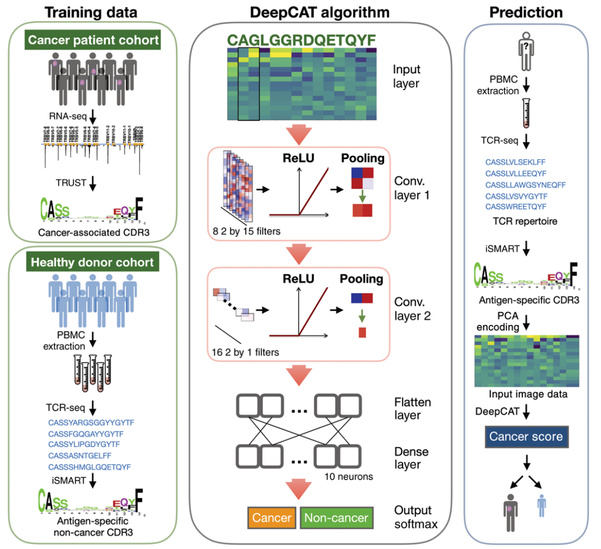

## De novo prediction of cancer-associated T cell receptors for noninvasive cancer detection

### Abstract

The adaptive immune system recognizes tumor antigens at an early stage to eradicate cancer cells. This process is accompanied by systemic proliferation of the tumor antigen–specific T lymphocytes. While detection of asymptomatic early-stage cancers is challenging due to small tumor size and limited somatic alterations, tracking peripheral T cell repertoire changes may provide an attractive solution to cancer diagnosis. Here, we developed a deep learning method called DeepCAT to enable de novo prediction of cancer-associated T cell receptors (TCRs).  We validated DeepCAT using cancer-specific or non-cancer TCRs obtained from multiple major histocompatibility complex I (MHC-I) multimer-sorting experiments and demonstrated its prediction power for TCRs specific to cancer antigens. We blindly applied DeepCAT to distinguish over 250 patients with cancer from over 600 healthy individuals using blood TCR sequences and observed high prediction accuracy, with area under the curve (AUC) ≥ 0.95 for multiple early-stage cancers. This work sets the stage for using the peripheral blood TCR repertoire for noninvasive cancer detection.

### Data and Code Availability

The authors have generously made Python scripts and data available on GitHub [https://github.com/s175573/DeepCAT]. `AAidx_PCA.txt`, as well as all files in the `data` folder, are copied from this repository.

### Model structure

| Model name | Input | Output | Loss Function | Model structure |
| ---------- | ----- | ------ | ------------- | --------------- |
| DeepCAT | Amino acid sequence of fixed length in range 12-16. | Binary classification logits | Cross Entropy | PCA embedding + 2 * Conv + (FC + Relu) + output | 

### Reference

Beshnova et al. [https://stm.sciencemag.org/content/12/557/eaaz3738]
