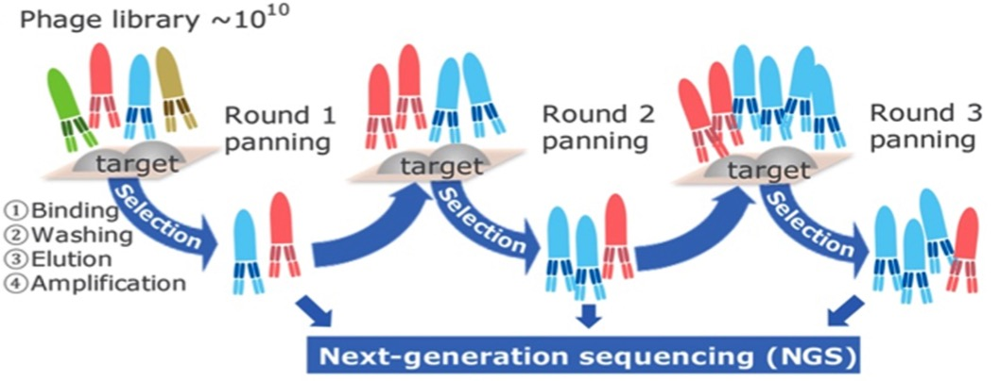
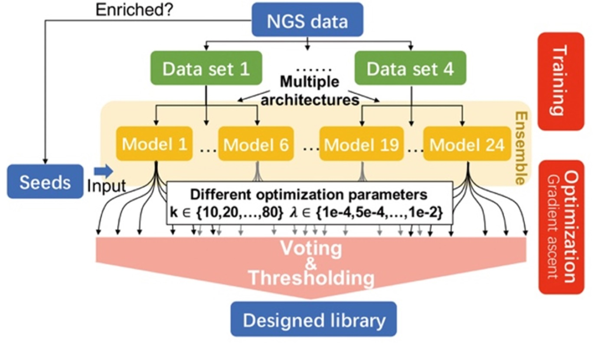
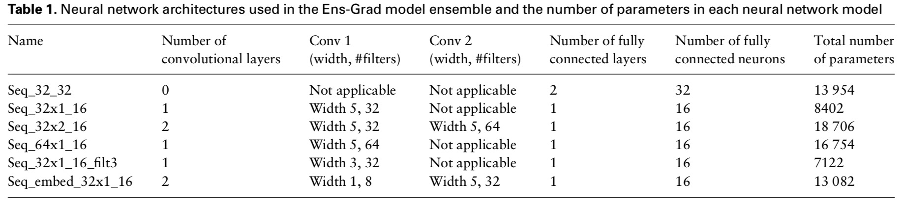

## Antibody complementarity determining region design using high-capacity machine learning

### Abstract

**Motivation**: The precise targeting of antibodies and other protein therapeutics is required for their proper function and the elimination of deleterious off-target effects. Often the molecular structure of a therapeutic target is unknown and randomized methods are used to design antibodies without a model that relates antibody sequence to desired properties.

**Results**: Here, we present Ens-Grad, a machine learning method that can design complementarity determining regions of human Immunoglobulin G antibodies with target affinities that are superior to candidates derived from phage display panning experiments. We also demonstrate that machine learning can improve target specificity by the modular composition of models from different experimental campaigns, enabling a new integrative approach to improving target specificity. Our results suggest a new path for the discovery of therapeutic molecules by demon- strating that predictive and differentiable models of antibody binding can be learned from high-throughput experi- mental data without the need for target structural data.

### Availability and implementation

Sequencing data of the phage panning experiment are deposited at NIH’s Sequence Read Archive (SRA) under the accession number SRP158510. The code is available at https:// github.com/gifford-lab/antibody-2019.

### Model structures

| Model name | Input | Output | Loss Function | 
| ---------- | ----- | ------ | ------------- | 
| Ens-Grad_quanlitative | CDR-H3 sequences (10~18 aa)| **Positive**: round3 frequency > 5e-5 or higher than its round 2 frequency by more than 1e-6; **Negative**: else | binary_crossentropy | 
| Ens-Grad_quantitative | CDR-H3 sequences (10~18 aa)| Round2-Round3 enrichment (log10 of the round-to-round ratio of sequence frequencies) | MSE |

### Reference

Liu et al. [https://academic.oup.com/bioinformatics/advance-article/doi/10.1093/bioinformatics/btz895/5645171]
