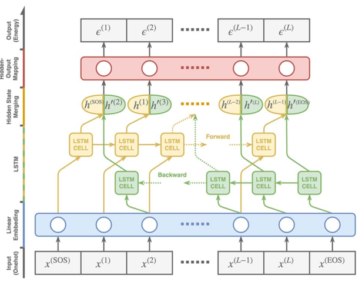

## Quantifying the nativeness of antibody sequences using long short-term memory networks.

### Abstract

Antibodies often undergo substantial engineering en route to the generation of a therapeutic candidate with good developability properties. Characterization of antibody libraries has shown that retaining native-like sequence improves the overall quality of the library. Motivated by recent advances in deep learning, we developed a bi-directional long short-term memory (LSTM) network model to make use of the large amount of available antibody sequence information, and use this model to quantify the nativeness of antibody sequences. The model scores sequences for their similarity to naturally occurring antibodies, which can be used as a consideration during design and engineering of libraries. We demonstrate the performance of this approach by training a model on human antibody sequences and show that our method outperforms other approaches at distinguishing human antibodies from those of other species. We show the applicability of this method for the evaluation of synthesized antibody libraries and humanization of mouse antibodies.

### Data Availability

Python scripts and data are made available on GitHub [https://github.com/vkola-lab/peds2019]

### Model structure

| Model name | Input | Output | Loss Function | Model structure |
| ---------- | ----- | ------ | ------------- | --------------- |
| LSTM seq | Amino acid sequence of length ~ 150 (gapped or without gap) | predicted full length sequence | NLLLoss (negative log likelihood, following log-softmax equal CrossEntropyLoss | Word embedding + Bi-directional LSTM + 3 * (FC + Relu) + log softmax | 

### Reference

Wollacott et al. [https://academic.oup.com/peds/advance-article/doi/10.1093/protein/gzz031/5554642]
