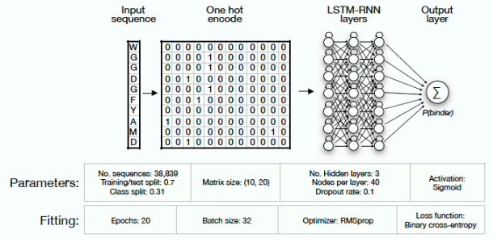

Two models from Mason et al. paper were developed and trained for antigen-specificity classification based on antibody sequences.

| Model name | Input | Output | Loss Function | Model structure |
| ---------- | ----- | ------ | ------------- | --------------- |
| CNN classifier | Amino acid sequence of length 10 (CDRH3 only) without gap | Probability of binding | Binary cross entropy | LSTM-RNN (3 layers, 40 hidden nodes, dropout rate = 0.1) + sigmoid activation |  
| LSTM RNN classifier | Amino acid sequence of length 10 (CDRH3 only) without gap | Probability of binding | Binary cross entropy | CNN (400 filters, kernel size 3, stride 1) + max pooling + FC + Relu activateion | 

**Reference**

Mason et al., Deep learning enables therapeutic antibody optimization in mammalian cells by deciphering high-dimensional protein sequence space. [https://www.biorxiv.org/content/10.1101/617860v3]

